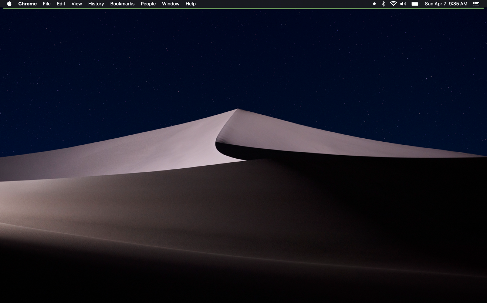

# Battery Bar

Battery Bar is an  [Übersicht](https://github.com/felixhageloh/uebersicht) widget
that provides a quick overview of how much battery the computer has left. It's inspired by [a similar utility for android](https://play.google.com/store/apps/details?id=com.bhanu.powerbar&hl=en)

## Installation

Download (or clone) this repository and place the folder in your Übersicht widgets directory.

## Configuration

Open [index.jsx](https://github.com/viktree/battery-bar/blob/master/index.jsx)
and edit as you'd like. Some of the objects toward the top should make
customization a little easier.

## Questions?

If you find a bug or have any questions about Bar, [submit an issue](https://github.com/viktree/battery-bar/issues/new).

